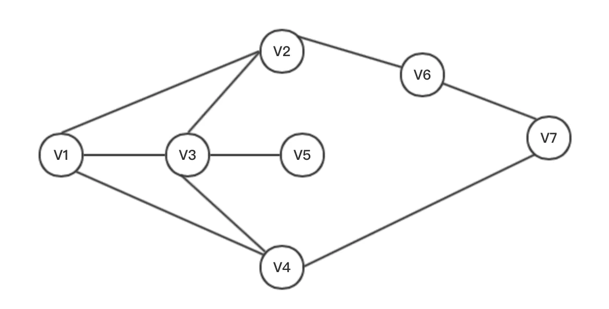
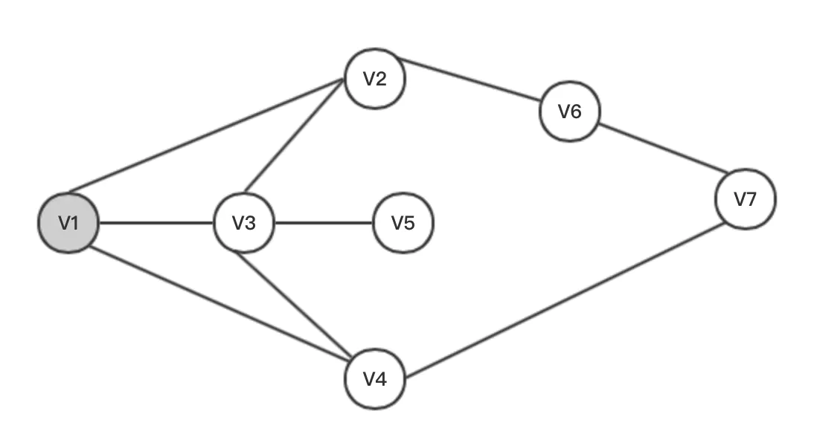
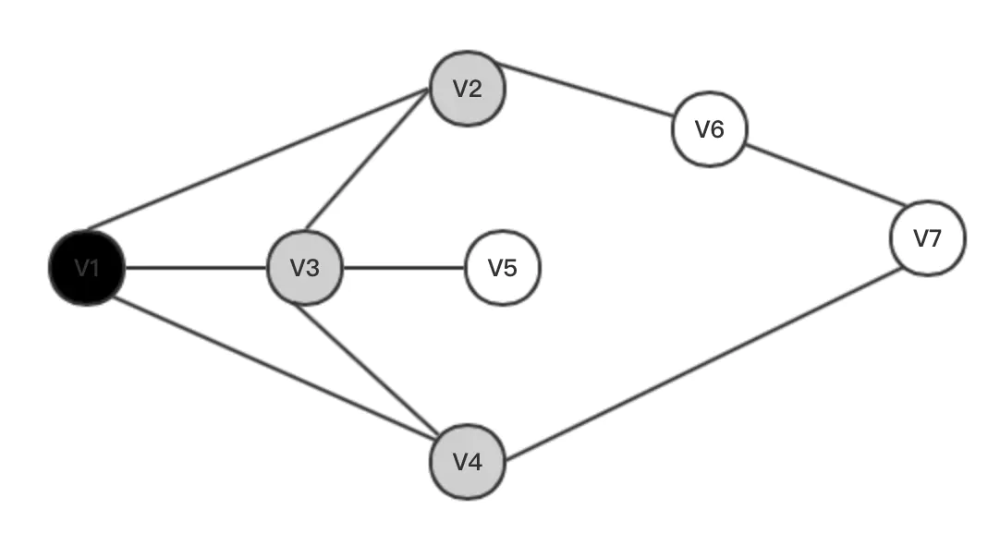
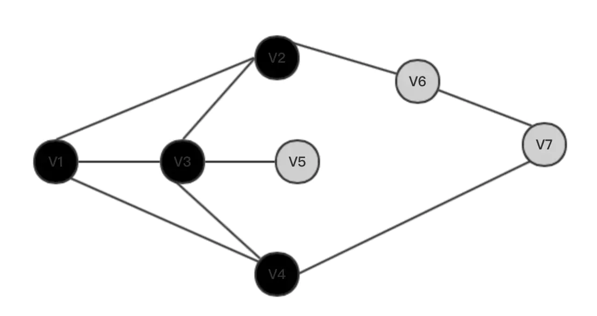

# 广度优先搜索

> 广度优先搜索是一种盲目搜寻法，不考虑结果的可能位置，彻底的搜索整张图，
> 直到所有节点都被搜寻过或是找到结果为止。
<!-- more -->
> 这里举个栗子


> 先给出一个所有节点都未被访问的连通图




> 然后搜索起点（搜索中标为灰色）



> 起点搜索后标黑，接着搜索其所有子节点



> 将起点的所有子节点看做新的起点，重复上述操作




> 终点被标记 结束搜索 最早标记终点的那条路径就是最短路径


## 算法实现思路

> 通过队列实现BFS，先将起点压入队尾，将队头元素的所有子节点
> 也压入队尾，如此往复，直至队列为空或是找到答案
> (比深搜简单多了)


## 例题 1


>洛谷 P1451_求细胞数量

题面如下

>题目描述
>
>
>一矩形阵列由数字 00 到 99 组成，数字 11 到 99 代表细胞，  
>细胞的定义为沿细胞数字上下左右若还是细胞数字则为同一细胞，求给定矩形阵列的细胞个数。
>
>
>输入格式
>
>
>第一行两个整数代表矩阵大小 n 和 m。
>
>接下来 n 行，每行一个长度为 m 的只含字符 0 到 9 的字符串，  
>代表这个 n×m 的矩阵。
>
>输出格式
>
>
>一行一个整数代表细胞个数。

样例如下

> 输入
>
>4 10  
>0234500067  
>1034560500  
>2045600671  
>0000000089  

> 输出
> 4

> 数据规模与约定
> 对于 100% 的数据，保证 1≤n,m≤100。

### 思路

> 遍历整个数组 当当前位置为细胞时 且未被标记过时（避免重复搜索使结果变大）
> 执行BFS 对连通的区域进行搜索 并使用数组标记 同时 令计数的cnt自增 
> 枚举完整个数组后就停止

### 编写代码


冲着练习BFS去的..这题标准的堪称BFS模板题

#### 通过数组进行模拟
> 没什么好说的..开一个数组对整个阵列进行模拟,这里我采用bool
> 类型的数组来省空间, 用xx，yy两个数组来模拟四个方向 
>再开两个队列来支持BFS

> 代码头
>(不建议万能头 因为编译会很慢 而且可移植性也很差（不过这个不重要）)


```C++
#include<iostream>
#include<cstdio>
#include<queue>

bool arr[107][107];
bool vis[107][107];
int xx[] = {-1,0,0,1};
int yy[] = {0,-1,1,0}; 
using namespace std;
queue<int> que_x,que_y;
```

#### 读入数据


> 值得一提的是输入有点小问题 最开始我打算使用整数直接读入，
> 后来发现会出bug 整个数字串都被读进去了....
> 所以最后凭着多年靠快读卡时间的老底 采用了一种类似
> 快读的写法..用以实现单个字符读入


```C++
inline bool read() 
{
	char ch = getchar();
	while(ch<'0'||ch>'9')
	ch = getchar();
	return ch == '0' ? 0 : 1;
}

cin >> n >> m;
for(int i=1;i<=n;++i)
{
	for(int j=1;j<=m;++j)
	{
		arr[i][j] = read();
	}
}
```


> (AC之后才发现这方法真的蠢..不过因为被奇妙的换行搞出阴影了，就没去改)
> 可以使用格式化输入 后文会提及


#### BFS
```C++
for(int i=1;i<=n;++i){ /* 原谅我这么多缩进*/
		for(int j=1;j<=m;++j){
			if(arr[i][j] && vis[i][j]==0 )
			{	/* 没被搜索过 且该点是细胞 */
				que_x.push(i);   /* 将该点的横纵坐标推进队列*/
				que_y.push(j);
				++ cnt;         /* 细胞个数+1 */
				while(!que_x.empty())  /* 当没有地方搜索时 队列只出不入 空队列即结束循环*/
				{
					int temp_x = que_x.front();  /* 提出队头横纵坐标 */
					int temp_y = que_y.front();
					que_x.pop();                /* 弹出队头 */
					que_y.pop();
					for(int k=0;k<4;++k)
					{           /* 四个方向进行搜索 */
						int tempx = temp_x + xx[k];  
						int tempy = temp_y + yy[k];
						if(tempx>=1&&tempx<=n&&tempy>=1&&tempy<=m&&vis[tempx][tempy]==0&&arr[tempx][tempy])
						{   /* 坐标在方位内、未被搜索过并且是细胞 就压入队列 成为新的子节点 */
							que_x.push(tempx);
							que_y.push(tempy);
							vis[tempx][tempy] = 1;  /* 标记已经搜索 */
						}
					}
				}	
			}
		}	
```
#### 输出
> 怎么感觉这个也写出来好像很丢人？


```C++
cout << cnt;
return 0;
```


### 完整代码

>代码如下
```C++
#include<iostream>
#include<cstdio>
#include<queue>

bool arr[107][107];
bool vis[107][107];
int xx[] = {-1,0,0,1};
int yy[] = {0,-1,1,0}; 
using namespace std;
queue<int> que_x,que_y;

inline bool read()
{
	char ch = getchar();
	while(ch<'0'||ch>'9')
	ch = getchar();
	return ch == '0' ? 0 : 1;
}


int main()
{
	int cnt = 0;
	int n,m;
	cin >> n >> m;
	for(int i=1;i<=n;++i)
	{
		for(int j=1;j<=m;++j)
		{
			arr[i][j] = read();
		}
	}
	for(int i=1;i<=n;++i)
	{
		for(int j=1;j<=m;++j)
		{
			if(arr[i][j] && vis[i][j]==0 )
			{	/* 没被搜索过 且该点是细胞 */
				que_x.push(i);
				que_y.push(j);
				++ cnt; 
				while(!que_x.empty())
				{
					int temp_x = que_x.front();
					int temp_y = que_y.front();
					que_x.pop();
					que_y.pop();
					for(int k=0;k<4;++k)
					{
						int tempx = temp_x + xx[k];
						int tempy = temp_y + yy[k];
						if(tempx>=1&&tempx<=n&&tempy>=1&&tempy<=m&&vis[tempx][tempy]==0&&arr[tempx][tempy])
						{
							que_x.push(tempx);
							que_y.push(tempy);
							vis[tempx][tempy] = 1;
						}
					}
				}	
			}
		}	
	}
	cout << cnt;
	return 0;
}
```

## 例题2

>洛谷P2199 最后的迷宫

题面如下

>题目背景
>哈利•波特作为三强争霸赛的第四名选手，历尽艰险闯到了最后一关——迷宫。
>
>现在，迷宫里只剩下哈利和塞德里克了，哈利只有在塞德里克前面拿到奖杯，才能赢得比赛。哈利只要能看到奖杯，就可以用飞来咒拿到它，所以，现在的问题是哈利如何能尽早地看到奖杯。
>
>题目描述
>哈利的视力非常好，他能从迷宫的一端沿直线看到迷宫的另一端（但他只能看八个方向——东北，东，东南，南，西南……），而且跑得非常快，跑一步（向上、下、左、右移动一格）
>只需要1s。但迷宫是不透光的，而且，要烧掉迷宫的墙也不容易，所以哈利决定绕到一个能够看到奖杯的地方。现在，哈利希望你能帮他确定最短需要多长时间才能拿到奖杯。
>
>输入格式
>第一行为2个数N，M表示迷宫的规模（N为高，M为宽）
>
>接下来是N*M的迷宫，O表示空地，X表示墙。
>
>最后是多对数据，分别是奖杯坐标及哈利的坐标（显然不可能在墙上），每对占一行，0为结束标志。
>
>输出格式
>根据每对数据，计算哈利拿到奖杯的最短时间，每对一行。如果魔法部有意难为选手，用墙将奖杯包围了起来，输出”Poor Harry”。
>
>输入输出样例  
>  
>输入   
>>3 4    
>>OXXO  
>>XXOO  
>>XOOO  
>>3 2 2 4  
>>3 3 1 1  
>>0 0 0 0 


>输出    
>>1   
>>Poor Harry  
>  
>说明/提示  
>
>对于30%的数据,有N*M<=100
>
>对于60%的数据,有N*M<=1600
>
>对于100%的数据,有N*m<=16384

### 完整代码

>代码如下
```C++
#include<iostream>
#include<queue>
#include<cstring>
#include<cstdio>
using namespace std;
bool arr[1600][1600];
int xx[] = {-1,0,0,1};
int yy[] = {0,-1,1,0};
int vis[1600][1600] = {0};
queue<int> que_x,que_y,que_deep; 

int main()
{
	int n,m;
	char temp;
	/*输入迷宫*/
	scanf("%d %d",&n,&m);
	for(int i=1;i<=n;++i)
	{
		for(int j=1;j<=m;++j)
		{  /* O->True X -> False*/
			cin >> temp;
			arr[i][j] = temp == 'O' ? 1 : 0;	
		}
	}
	
	while(1)
	{
		int end_x,end_y,x0,y0;
		cin >> end_x >> end_y >> x0 >> y0 ;
		/*********/
        if(x0==0&&end_x==x0&&x0==y0&&y0==end_y)   /* 先标记八个方向 当搜索到被标记的点的时候 就停止 */
        return 0;
		/****判断*/
        int vis[1600][1600]={0};
        for(int p=end_x;p>=1&&arr[p][end_y];--p)
		vis[p][end_y] = 7;
		for(int p=end_x;p<=n&&arr[p][end_y];++p)
		vis[p][end_y] = 7;
				/*纵向*/
		for(int p=end_y;p>=1&&arr[end_x][p];--p)
		vis[end_x][p] = 7;
		for(int p=end_y;p<=m&&arr[end_x][p];++p)
		vis[end_x][p] = 7;
				/*斜向*/
		for(int px=end_x,py=end_y;px>=1&&py>=1&&arr[px][py];--px,--py)
		vis[px][py] = 7;
		for(int px=end_x,py=end_y;px<=n&&py<=m&&arr[px][py];++px,++py)
		vis[px][py] = 7;
		for(int px=end_x,py=end_y;px>=1&&py<=m&&arr[px][py];--px,++py)
		vis[px][py] = 7;
		for(int px=end_x,py=end_y;px<=n&&py>=1&&arr[px][py];++px,--py)
		vis[px][py] = 7;

        if(vis[x0][y0]==7)
        {cout << 0 <<endl;goto loop;}
		que_x.push(x0);
		que_y.push(y0);
        que_deep.push(0);
        vis[x0][y0] = 1;
		while(!que_x.empty())
		{
			for(int params=0;params<4;++params)
			{
				int tempx = que_x.front() + xx[params];
                int tempy = que_y.front() + yy[params];
				if(1<=tempx&&tempx<=n&&1<=tempy&&tempy<=m&&vis[tempx][tempy]==0&&arr[tempx][tempy])
				{
					que_x.push(tempx);
					que_y.push(tempy);
					que_deep.push(que_deep.front()+1);
					vis[tempx][tempy] = 1;
				}
                if(vis[tempx][tempy]==7)
                {
                   cout << que_deep.front() + 1<<endl;
                   while(!que_x.empty())
                   {
                        que_x.pop();
                        que_y.pop();
                        que_deep.pop();
                   }
                   goto loop;
                }
			}
			que_x.pop();
			que_y.pop();
			que_deep.pop();
		}
        cout << "Poor Harry"<<endl;
		loop:continue;
	}
	return 0;
}
}
```


### 小结

>1. 当遇到像题目这样有特殊读入需求的时候，尽量采用`scanf`格式读入字符，
>像题目这样的输入，除去`getchar()`, 还可以使用`scanf("%1d",&arr[i][j]);`
>即读入整数 但只读入一位数字

>2. 判断边界条件的时候一定要好好思考，因为条件很多，很容易有错漏，并且
>很多BFS题目需要用数组来标记，条件的先后顺序也很重要，要是把数组判断放
>在前面，很有可能越界访问，使程序崩溃，最好先判断边界，再判断数组条件

>3. 要注重实践，但也不要只实践而忽略了理论知识的学习。