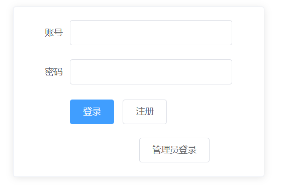
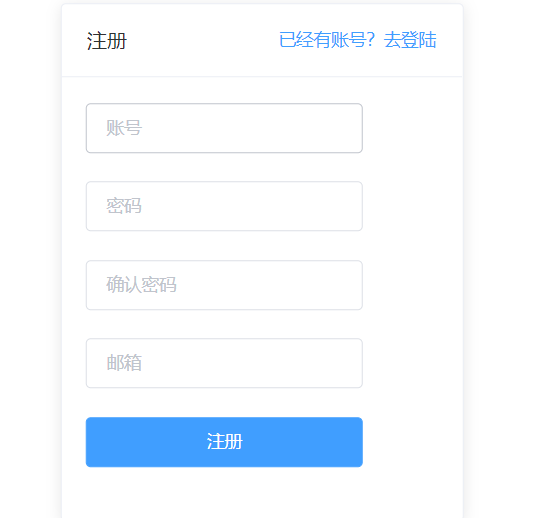
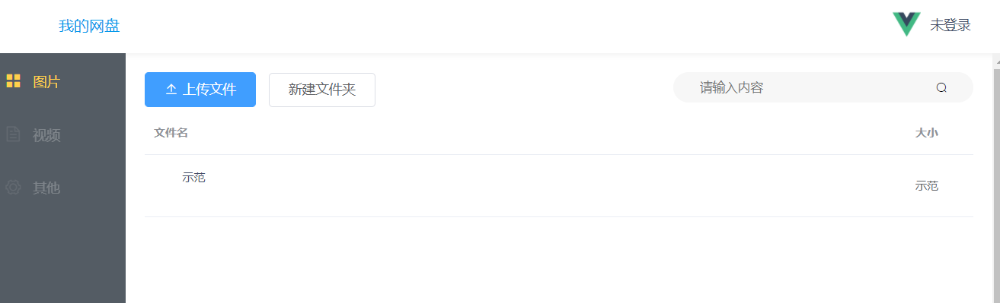

### 西二在线考核项目 vue网盘

在这过程中遇到不少坑，在此记录

##### 项目介绍

###### 前端

- vue
- vue-router
- vuex
- axios
- webpack 

###### 后端

- java

  

###### 已实现功能

- 注册登录

- 上传文件

- 新建文件夹

- 管理员相关功能

  * 删除审核失败文件

  * 查看相关用户

    

###### 期间遇到问题与解决方法，些许建议

- 跨域问题
  - 方案：前端使用vue自带的api代理或者后端进行修改
  - [vue3代理](https://segmentfault.com/a/1190000011007043)

- 数据库字段与前端预计的字段不太相符
  - 建议！ 一定要先和后端商量好字段和逻辑关系，后端后面要修改字段很麻烦！

- element（懒人救星）
  -  element-ui一定要好好利用，可以解决很多问题，省下很多设计页面的时间。
  - [element安装](https://element.faas.ele.me/#/zh-CN/component/installation)

- cookie相关问题
  - chrom出现不携带cookie问题时不妨试试火狐浏览器

###### 功能的实现

- 注册登录

  - 使用element组件

    - 组件自带验证规则，只需要编写规则就好

    ​    

- 上传文件

  - element  upload上传组件
    - beforeupload函数（解决表单自动提交问题）

- 新建文件夹

  - 实现方法较为复杂，有兴趣可以把项目下下来研究，大致流程为：新建文件夹后自动进入该文件夹，出现返回上一级标签，点击后返回主目录，主目录出现该文件夹

- 管理员功能

  - 涉及多个页面跳转，实现方法较为繁琐，此处不一一说明

####	项目演示

[项目地址](https://github.com/lonelyiii/-)

