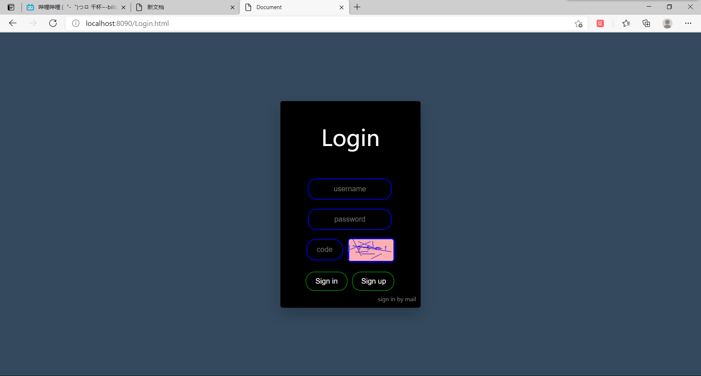
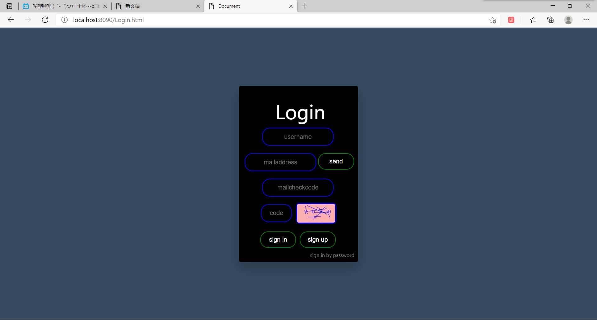
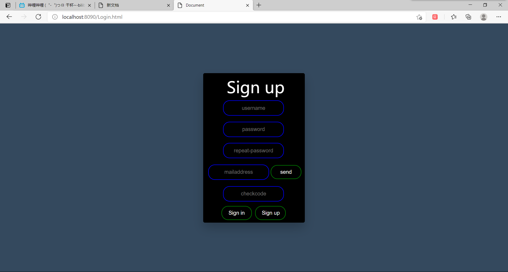
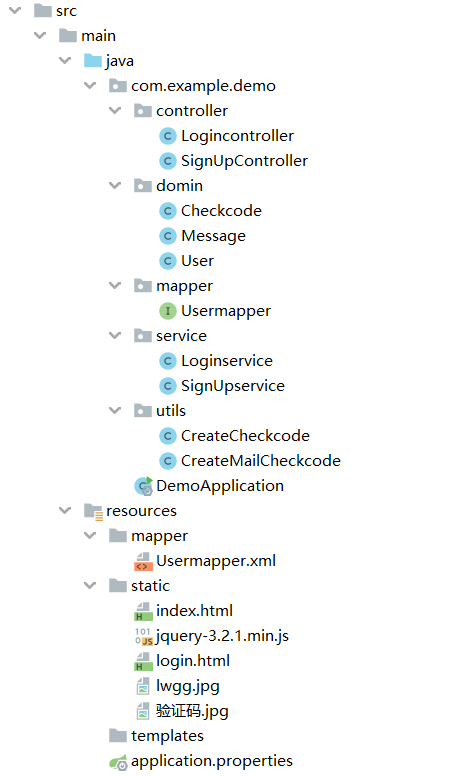
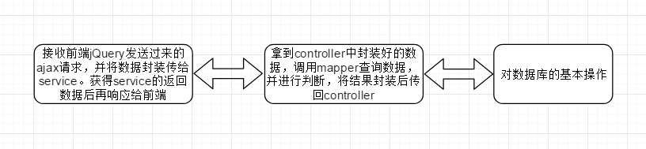
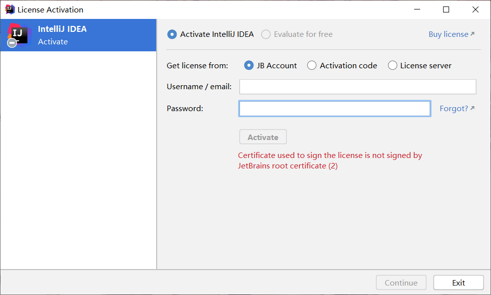
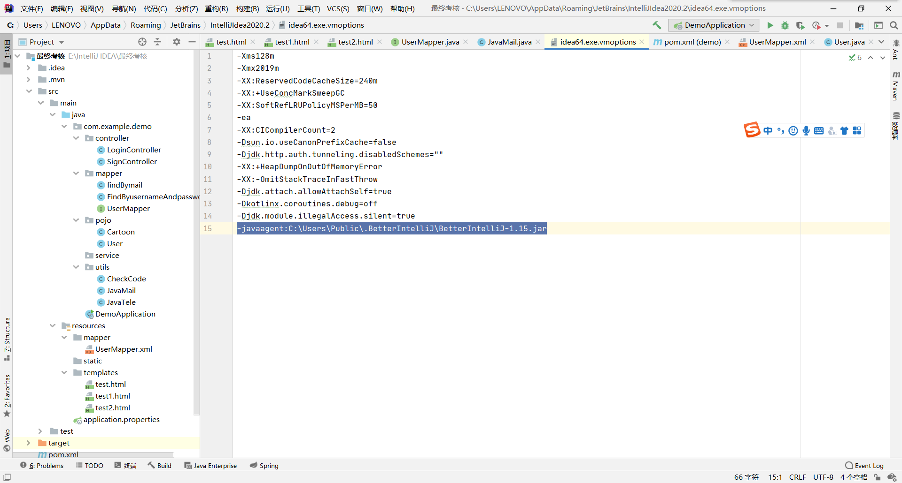

<h1>
用springboot配合jQuery写一个特别简单的登录网页
</h1>
##一.预期效果
一个登陆页面应该具有如下的**基本功能**：

>* 用户名和密码登录
>* 用户注册
>* 其他登录方式（这里我选用邮箱注册）
>* 使用图形验证码来防止恶意注册
>* 对用户的输入状态进行检测

**附加效果**
>
>* 登录表单和注册表单的切换
>* css样式渲染
>* 发送验证码后进行计时
##二.框架构思
###前端页面设计

 用一个div作为容器，来存放其他有不同表单的div容器

统一采用jQuery来获取表单的输入元素与向后台发送请求
>* 密码登录
   * 当用户输入用户名后，对用户名是否存在进行一次检测，**采用get方法**向后台发送数据，后台返回bean对象，根据bean对象的username变量是否为空来判断用户名是否已经存在
   * 向后台请求生成图像验证码
   * 当用户点击提交按钮后，采用jQuery获取输入框的参数，并检测是否输入；**采用post方法向后台发送ajax请求**，json格式为：**"data":{"username":username,"password":password,"checkcode":checkcode}**
   * 根据返回的bean对象的username是否为空，来决定是否进行资源跳转
>* 用户注册
   * 当用户输入用户名后，对用户名是否已经注册进行检测，同样采用get方法
   * 在前端完成密码重复输入的检测
   * 输入邮箱后，在点击“send”按钮后对邮箱是否已经注册进行检测，若未注册，则发送验证码。**采用get方法**向后台发送数据；为了防止用户恶意请求发送验证码，当验证码发送成功后，对发送按钮进行锁定，并在上面显示倒计时
   * 点击注册按钮后，采用jQuery获取输入框的参数，并检测是否输入；**采用post方法向后台发送请求**，json格式为：**"data"{ "username":username,"password":password,"mailaddress":mailaddress,"checkcode":checkcode}**；根据返回的bean对象的username是否为空，来判断是否注册成功；当注册完成后，将返回登录页面
>* 邮箱登录
   * 邮箱登录可谓是结合了密码登录和用户登录的特点。首先和密码登录一样，对用户输入的用户名进行检测，采用**get方法**
   * 填写邮箱，并对邮箱是否已经注册进行检测，采用**get方法**
   * 发送验证码，具体实现和用户注册中的操作类似
   * 向后台请求生成图像验证码
   * 点击登录按钮后，采用jQuery获取输入框的参数，同样检测是否输入；**采用post方法向后台发送ajax请求**，json格式为：**"data":{"username":username,"mailaddress":mail,"checkcode":checkcode,"mailcheckcode":mailcheckcode }**；根据返回的bean对象的username是否为空，来判断是否登录成功；当登录成功后，将进行资源的跳转

###后端架构
采用三层架构，分别是controller层，service层和mapper层
>* controller层
   * 针对登录和注册两种操作，写了两个具体的controller类，分别是Logincontroller和SignUpcontroller，各自的方法分别为：
   * **Logincontroller**
   	  * 生成图像验证码
      * 对用户名是否存在进行检测，并作出响应
      * 对邮箱是否存在进行检测，并作出响应
      * 发送邮箱验证码
      * 对密码登录发送过来的数据进行操作（发送到对应的service类中），并作出响应
      * 对邮箱登录发送过来的数据进行操作，并作出响应
   * **SignUpcontroller**
      * 对用户名是否存在进行检测，并作出响应
      * 对邮箱是否存在进行检测，并作出响应
      * 发送邮箱验证码
      * 对注册发送过来的数据进行操作，并作出响应
   * PS：其实这两个类完成可以合并的，搞完后才发现设计得不太合理（地铁老人看手机）
>* service层
   * 操作mapper层，进行数据的查找和一些特殊业务逻辑的实现（如发送邮箱验证码，生成图形验证码，同样也有两个具体service类：Loginservice和Signupservice
   * **Loginservice**
      * 根据用户名进行查找，并将提示信息封装进bean对象中返回（下同）
      * 根据邮箱进行查找
      * 根据用户名和密码查找（针对密码登录）
      * 根据用户名和邮箱查找（针对邮箱登录）
      * 生成图形验证码
      * 发送qq邮件
    * **SignUpservice**
      * 根据用户名进行查找，并将提示信息封装进bean对象中返回（下同）
      * 根据邮箱进行查找
      * 发送qq邮件
      * 创建新的用户信息
>* mapper层
   * 与数据库打交道的架构层，这里需要的方法有：
      * 根据用户名进行查询
      * 根据用户名和密码进行查询
      * 创建新用户
      * 根据邮箱进行查询
      * 根据用户名和邮箱进行查询

除了三大架构层外，还有domain层用来创建bean对象，utils层（我把它当service层了233）用来放一些特殊的业务逻辑代码（在这里我写了发送邮件和创建图像验证码的代码） 
##三、正式开始
渲染效果如下
>**密码登录界面**
>
>
>
>**邮箱登录界面**
>
>

>**注册界面**

>

说明：通过”sign up“、”sign in“、”sign in by mail“和”sign in by password“可以实现这几个界面在同一个页面中的切换

>几处比较重要的jQuery代码的编写

	//点击图像验证码刷新
	$("img").click(function (){
                var date = new Date().getTime();
                //加上时间戳防止客户端的本地缓存
                $("img").attr("src","/Login//getCheckcode?"+date)
            })
>

    //密码登录传送数据
            $("#input3").click(function (){
                var username = $("#input1").val()
                var password = $("#input5").val()
                var checkcode = $("#input2").val()
                // alert("username:"+username+"password:"+password+"checkcode:"+checkcode)
                //在前端完成输入检测
                if(username==""){
                    alert("请输入用户名！")
                }else if(password==""){
                    alert(("请输入密码！"))
                }else if(checkcode==""){
                    alert("请输入验证码！")
                }else {
                    $.ajax("/Login/check2",{
                        "type":"post",
                        "data":{
                            "username":username,
                            "password":password,
                            "checkcode":checkcode
                        },
                        "success":function (data){
                            // alert("success")
                            if(data.username==null) alert(data.message)
                            else {
                                alert(data.message)
                                $(location).attr("href","index.html")
                            }
                        }
                    })
                }
            })
>邮箱登录和注册的发送数据代码和上述代码相似

            //发送邮箱验证码
            $("#input11").click(function (){
                var mail = $("#input9").val()
                if(mail == ""){
                    alert("请输入QQ邮箱！")
                }else {//对邮箱格式进行检测（可以检测后缀是否正确）
                    var reg = /^([a-zA-Z0-9_-])+@([a-zA-Z0-9_-])+((\.[a-zA-Z0-9_-]{2,3}){1,2})$/;
                    if(!reg.test(mail)){
                        alert("邮箱格式不正确，请重新输入！")
                        $("#input9").val("")
                    }else {
                        $.get("/SignUp/getMailcheckcode",{mailaddress:mail},function (data){
                            //检测邮箱是否已经被注册
                            alert(data.message)
                            //借助返回数据的username是否为空来判断邮箱是否已经被注册
                            if(data.username!=null){
                                $("#input9").val("")
                            }else {
                                //    写一个计时器
                                //    先把发送按钮锁定（这里应该用true而不是"true"）
                                $("#input11").attr("disabled",true)
                                //确定倒计时的秒数
                                var seconds = 60;
                                //声明定时器
                                var timer = null;
                                //    开启定时器
                                timer = setInterval(function (){
                                    if(seconds==0){
                                        clearInterval(timer)//清除计时器
                                        //解锁按钮
                                        $("#input11").attr("disabled",false).val("send")
                                        return;
                                    }
                                    $("#input11").val(seconds)
                                    seconds--;
                                },1000)//时间间隔为1s
                            }
                        })
                    }

                }
            })

接下来展示后端的结构
>
>
>
接下来以密码登录为例，展示三层架构的具体操作
>
>

**Controller层**

    	@RequestMapping("/check2")
    	public @ResponseBody User Check(@RequestParam String username,String password,String checkcode,HttpServletRequest request){
        HttpSession session = request.getSession();
        String checkcode1 = (String) session.getAttribute("checkcode1");
        User user = new User();
        user.setUsername(username);
        user.setPassword(password);
        User _user = loginservice.Logincheck1(user,checkcode,checkcode1);
        return _user;
	    }

**Service层**

    public User Logincheck1(User user,String checkcode,String checkcode1){
        User _user = new User();
        if(!checkcode1.equals(checkcode)){
            _user.setMessage("验证码错误！");
        }else {
            _user = usermapper.findByusernameAndpassword(user);
            if(_user==null){
                System.out.println("登录失败！");
                User __user = new User();
                __user.setMessage("用户名或密码错误！");
                return __user;
            }else _user.setMessage("登录成功！");
        }
        return _user;
    }

**mapper层**

	@Mapper
	public interface Usermapper {
    public User findByusername(String username);
    public User findByusernameAndpassword(User user);
	}
##四、遇到的问题
>* 在打这个项目的时候，首先遇到的问题就是session域的创建时机出错。这个问题在我第一次尝试做登录页面的时候就出现了，但是当初没有解决。根据错误信息，我发现是我session的创建时机是在对前端的响应完成之后，只要将session域的创建提前即可解决。

>错误信息

>错误代码如下：

    @RequestMapping("/getCheckcode")
    public void GetCheckcode(HttpServletRequest request, HttpServletResponse response) throws IOException {
        Checkcode create = createCheckcode.Create();
        BufferedImage bufferedImage = create.getBufferedImage();
        String checkcode = create.getCheckcode();
        System.out.println(checkcode);
        ImageIO.write(bufferedImage,"jpg",response.getOutputStream());
        HttpSession session = request.getSession();
        session.setAttribute("checkcode1",checkcode);
    }

>改正后：

    @RequestMapping("/getCheckcode")
    public void GetCheckcode(HttpServletRequest request, HttpServletResponse response) throws IOException {
        Checkcode create = createCheckcode.Create();
        BufferedImage bufferedImage = create.getBufferedImage();
        String checkcode = create.getCheckcode();
        HttpSession session = request.getSession();
        session.setAttribute("checkcode1",checkcode);
        System.out.println(checkcode);
        ImageIO.write(bufferedImage,"jpg",response.getOutputStream());
    }

>* 之后，我又遇到了一个问题。问题的大致描述如下：“你的主机中的软件中止了一个已建立的连接。”刚刚看到这个问题我是特别懵逼的，因为学了一段时间的开发都还没出现过中文的提示语。百度后才得知，这个问题的可能原因为前端向后端发送请求的时间过长，超过了网关预设的时间（一般为1s）。翻看我的代码得知，我不小心把两个发送请求的代码块写在一起了（汗），分开后，问题就得到了解决。（遇到问题时忘记存图了。。。）

>* 还有一个比较大的问题就是，我intellij idea的破解过期了。。。用教育邮箱申JB Account后尝试正版登录，结果出现了这么一句错误提示：

>一番百度后找到解决办法，即将下图中的最后一段代码注释掉：

##五、心得体会
这次的登录案例是我自从学开发以来打出来的第一个成功的案例，而且这个过程竟然没遇到什么太棘手的问题（也许是之前尝试两三次，有不少失败的经历了233333）。但是，一些小问题还是存在的，我的代码仍有极大的提高空间。比如说，由于一开始考虑不周，导致css的样式设计很混乱，搞了20个id来控制各个表单元素；后端代码的结构还是没考虑清楚，存在代码重复的情况（如Logincontroller和SignUpcontroller中有大量重复的代码，他们完全是可以合并的），这些都为我以后开发新的项目提供了宝贵的经验。
##六、下阶段计划
下一个阶段，我打算继续回归到后端的学习中来（我感觉前端的基础知识已经够我划水了），计划先把前面赶进度跳掉的部分补上，如mybatis的动态代理，spring的面向切面编程。