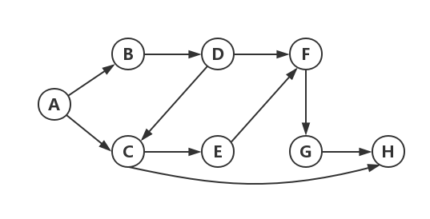

## 一、简介

广度优先搜索算法（Breadth-First Search，BFS）是从图的一个节点开始，按照第一步能到达的所有节点，第二步能到达的所有节点，这样依此搜索，直到搜索完成整张图。这种算法可以解决两种问题：

-  第一类问题：从节点A出发，**是否**有前往节点B的路径？
-  第二类问题：从节点A出发，前往节点B的哪条路径**最短**？ 

## 二、举例

如图，求A到H的**最短**路径?



首先，记录下A第一步能经过的节点B和C

然后，依此搜寻B和C所能到达的节点，B能到达D，C能到达H，E

这时，因为我们是按一步能到达的节点，两步能到达的节点搜寻的，我们搜寻到了H，即可保证A-C-H这提艾路径是最短的

## 三、如何实现？

### 队列

队列是一种受限制的线性表，它只允许从一端插入数据，从另一端删除数据（FIFO），即：先来先服务。

如何实现队列呢？一个简单的方法是我们利用一个数组，并设置两个变量front和rear作为“指针”，利用a[++rear] = val来插入数据，利用front++来删除数据。当然，这只是一个粗浅的实现方式，这会导致插入删除后有很多空间无法被利用，较好的方法是使用环形队列，但在做题时这有点麻烦。不过如果使用Java和C++，他们本身就自带队列的API

**环形队列**

参见：https://www.icourse163.org/learn/ZJU-93001?tid=1462787444#/learn/content?type=detail&id=1239897401&cid=1261105636

```c++
typedef int Position;
struct QNode {
    ElementType *Data;     /* 存储元素的数组 */
    Position Front, Rear;  /* 队列的头、尾指针 */
    int MaxSize;           /* 队列最大容量 */
};
typedef struct QNode *Queue;

Queue CreateQueue( int MaxSize )
{
    Queue Q = (Queue)malloc(sizeof(struct QNode));
    Q->Data = (ElementType *)malloc(MaxSize * sizeof(ElementType));
    Q->Front = Q->Rear = 0;
    Q->MaxSize = MaxSize;
    return Q;
}

bool IsFull( Queue Q )
{
    return ((Q->Rear+1)%Q->MaxSize == Q->Front);
}

bool AddQ( Queue Q, ElementType X )
{
    if ( IsFull(Q) ) {
        printf("队列满");
        return false;
    }
    else {
        Q->Rear = (Q->Rear+1)%Q->MaxSize;
        Q->Data[Q->Rear] = X;
        return true;
    }
}

bool IsEmpty( Queue Q )
{
    return (Q->Front == Q->Rear);
}

ElementType DeleteQ( Queue Q )
{
    if ( IsEmpty(Q) ) { 
        printf("队列空");
        return ERROR;
    }
    else  {
        Q->Front =(Q->Front+1)%Q->MaxSize;
        return  Q->Data[Q->Front];
    }
}
```


### 真正实现

我们的思路是：设置一个队列和一个vis数组标记是否到达过该节点。从一个节点出发，搜寻该节点一步能到达的所有节点（注意判断实际题目时候的边界条件），将这些节点插入队尾。接着不断取出队首，搜寻队首的一步能到达的所有节点并将它们插入队尾。当队列变空的时候，即代表搜索完成。注意每搜寻一个节点时要将节点对应的vis设为true，我们不搜寻已经visit过的节点，否则可能出现死循环。

### 例题


#### 一、龙舌兰酒吧

有一个大小为n*m的矩形小镇，城镇上有房屋（“#”表示，无法通过），有空地（“.”表示，可通行），每次移动只能朝上下左右四个方向，且需花费1单位时间。

一天，二乔和承太郎约定在龙舌兰酒吧见面，两人同时从各自所在位置向酒吧出发。请问最少需要过多少时间他们才能在酒吧碰面。

地图上P表示二乔的位置，W表示承太郎的位置，B表示酒吧的位置。

#### 输入格式:

第一行包含两个整数n,m，表示城镇的大小。（1<=m,n<=1000)。

接下来n行，每行m个字符，表示小镇的情况。

#### 输出格式:

输出两人在酒吧碰面的最少花费时间，如果无法在酒吧碰面则输出-1。

#### 输入样例:

```in
5 4
.W.#
P#..
....
B..#
#...
```

#### 输出样例:

```out
4
```

#### 代码

```c++
#include<bits/stdc++.h>
#define inf 0x3f3f3f3f
struct Node{
	int x;
	int y;
};
int next[4][2] = {{0,1},{1,0},{0,-1},{-1,0}};
Node que[1000000];
bool vis[1001][1001];
char a[1010][1010];
int step[1001][1001];
int n,m;

bool judge(Node temp){
	if(temp.x>=1&&temp.y>=1&&temp.x<=n&&temp.y<=m&&!vis[temp.x][temp.y]&&a[temp.x][temp.y]!='#'){
		return true;
	}else{
		return false;
	}
}

void bfs(Node x){
	memset(vis,false,sizeof(vis));
	memset(step,0x3f,sizeof(step));
	step[x.x][x.y] = 0;
	int front  = 1,rear = 0;
	que[++rear] = x;
	
	while(front <= rear){
		Node top = que[front];
		front ++;
		for(int i = 0; i < 4; i++){
			Node temp = top;
			temp.x += next[i][0];
			temp.y += next[i][1];
			if(judge(temp)){
				vis[temp.x][temp.y] = true;
				que[++rear] = temp;
				step[temp.x][temp.y] = step[top.x][top.y] + 1;
			}
		}
	}
}

int main(){

	scanf("%d%d",&n,&m);
	getchar();
	Node p1,p2,des;
	for(int i = 1; i <= n ; i ++){
		for(int j = 1; j <= m; j++){
			a[i][j] = getchar();
			if(a[i][j] == 'P'){
				p1 = (Node){i,j};
			}
			if(a[i][j] == 'W'){
				p2 = (Node){i,j};
			}
			if(a[i][j] == 'B'){
				des = (Node){i,j};
			}
		}
		getchar();
	}
	
	bfs(p1);
	int t1 = step[des.x][des.y];
	bfs(p2);
	int t2 = step[des.x][des.y];
	if(t1 == inf || t2 == inf){
		printf("-1");
	}else{
		if(t1>t2){
            printf("%d",t1);
        }else{
            printf("%d",t2);
        }
	}
	return 0;
}
```

这里的实现细节是：在处理迷宫问题时，我们如何完成搜寻这个动作？答案是利用

```c++
int next[4][2] = {{0,1},{1,0},{0,-1},{-1,0}};
for(int i = 0; i < 4; i++){
			Node temp = top;
			temp.x += next[i][0];
			temp.y += next[i][1];
			//操作
}
```

这样每循环一次i，就等于走了一个方向。


#### 二、**奇怪的电梯**

7-10 奇怪的电梯 (100 分)


c大楼有一个一种很奇怪的电梯。大楼的每一层楼都可以停电梯，而且第 i 层楼 (1≤i≤N) 上有一个数字Ki(0≤Ki≤N)。电梯只有四个按钮：开，关，上，下。上下的层数等于当前楼层上的那个数字。当然，如果不能满足要求，相应的按钮就会失灵。例如：3,3,1,2,5 代表了Ki (K1=3,K2=3,…)，在1楼，按“上”可以到4楼，按“下”是不起作用的，因为没有−2楼。那么，从A楼到B楼至少要按几次按钮呢？

### 输入格式:

第一行包含3个用空格隔开的正整数，分别表示N,A,B (1≤N≤200,1≤A,B≤N) 。 第二行包含N 个用空格隔开的非负整数，表示Ki 。

### 输出格式:

输出共一行，即最少按键次数,若无法到达，则输出 −1 。

### 输入样例:

```in
5 1 5
3 3 1 2 5
```

### 输出样例:

```out
3
```

#### 代码

```c++
#include<bits/stdc++.h>

int a[201];
int vis[201];
int step[201];
int que[201];
int next[2] = {1, -1};//这里是一维，采用这种方式偏移
int front = 1,rear = 0;
int n,start,end;

bool judge(int temp){
	if (!vis[temp]&&temp<=n&&temp>=1){
		return true;
	}else{
		return false;
	}
}

void bfs(){
	while(front <= rear){
		int top = que[front];
		front++;
		for(int i = 0; i < 2; i++){
			int temp = top;
			temp += next[i] * a[temp];
			if(judge(temp)){
				que[++rear] = temp;
				vis[temp] = 1;
				step[temp] = step[top] + 1;
			}
		}
	}	
}
int main(){
	memset(step,0x3f,sizeof(step));
	scanf("%d%d%d",&n,&start,&end);
	for(int i = 1; i <= n ; i++){
		scanf("%d",&a[i]);
	}
	step[start] = 0;
	vis[start] = 1;
	que[++rear] = start;
	bfs();
    if(step[end]==0x3f3f3f3f){
        printf("-1");
    }else{
        printf("%d",step[end]);
    }
	return 0;
} 
```


## 总结

我们可以总结出如下模板处理一般的迷宫类广度优先搜索问题：

```C++
#include<bits/stdc++.h>
#define inf 0x3f3f3f3f
struct Node{
	int x;
	int y;
};
int next[4][2] = {{0,1},{1,0},{0,-1},{-1,0}};
Node que[1000000];
bool vis[1001][1001];

bool judge(Node temp){
	if(还未visit+边界条件){
		return true;
	}else{
		return false;
	}
}

void bfs(Node x){
	int front  = 1,rear = 0;
	que[++rear] = x;
	
	while(front <= rear){
		Node top = que[front];
		front ++;
		for(int i = 0; i < 4; i++){
			Node temp = top;
			temp.x += next[i][0];
			temp.y += next[i][1];
			if(judge(temp)){
				vis[temp.x][temp.y] = true;
				que[++rear] = temp;
				//根据题意操作
			}
		}
	}
}

int main(){
	//各种初值初步处理
    //第一个节点的初始化
    //BFS()
   
}
```

