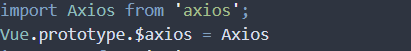
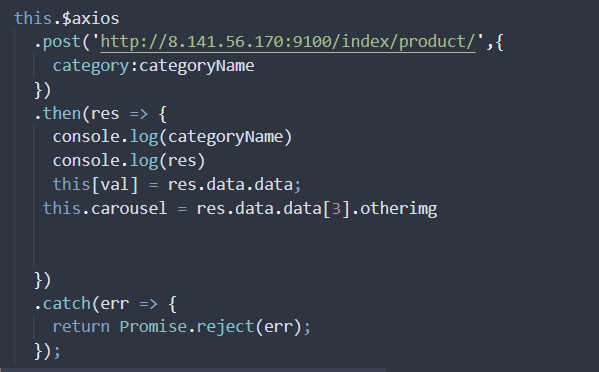
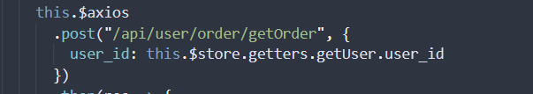

- axios介绍
  - axios是一个http库，可在vue中使用
  - [详细介绍](https://www.cnblogs.com/xiugeng/p/10771686.html)

- 安装

  - 此处介绍在vue下的安装

  - npm install axios

  - 在vue文件中使用需要引入  import axios from ;axios

  - 也可以在main.js（vue-cli）中全局配置  如

     全局配置后，在vue中使用只需this.$axios	-

-  axios包含的方法（常用，但此处不作为重点）

  - get
  
  - post  
  
  - put
  
  - [使用方法](https://www.kancloud.cn/yunye/axios/234845)
  
    
  
  - 例： 
  
- 设置代理

  - 在前后端分离开发时，本地开发会遇到跨域拦截，可在vue中设置代理解决，由于不同版本的设置方法不同，此处介绍vue-cli2的设置方法

  - 打开config/index.js文件，找到dev下的proxyTable

  - ```vue
    proxyTable: {
       '/api': {
             target:'http://www.baidu.com/',//后端地址
             changeOrigin:true, //允许跨域
             pathRewrite:{
                 '^/api': '' 
             }
         }
     }
    ```

  - 当调用后端接口时，只需要'/api/接口'/就可以成功跨域

  - 例  

- cookie问题

  - axios默认是不携带cookie，若想在请求中携带cookie，要配置相关属性

  - 在main.js中，配置如下两项

  - Axios.defaults.crossDomain = true;

    Axios.defaults.withCredentials  = true;

- 开发环境与正式环境

  - vue代理只对开发环境有效，若要打包部署到线上，要将api换为具体的后端地址，这样做有点繁琐，可在config/index.js中做环境判断

  - ```
    let baseURL
    // 判断开发环境（一般用于本地代理）
    if (process.env.NODE_ENV === 'development') { // 开发环境
        baseURL = '/api'    // 对应上面的代理名 api
    } else {                                      // 编译环境
        if (process.env.type === 'test') {        // 测试环境
            baseURL = 'http://sw.apitest.com'       // 后端测试地址
        } else {                                  // 正式环境
            baseURL = 'http://sw.api.com'                //后端正式地址
            
        }
    }
    ```